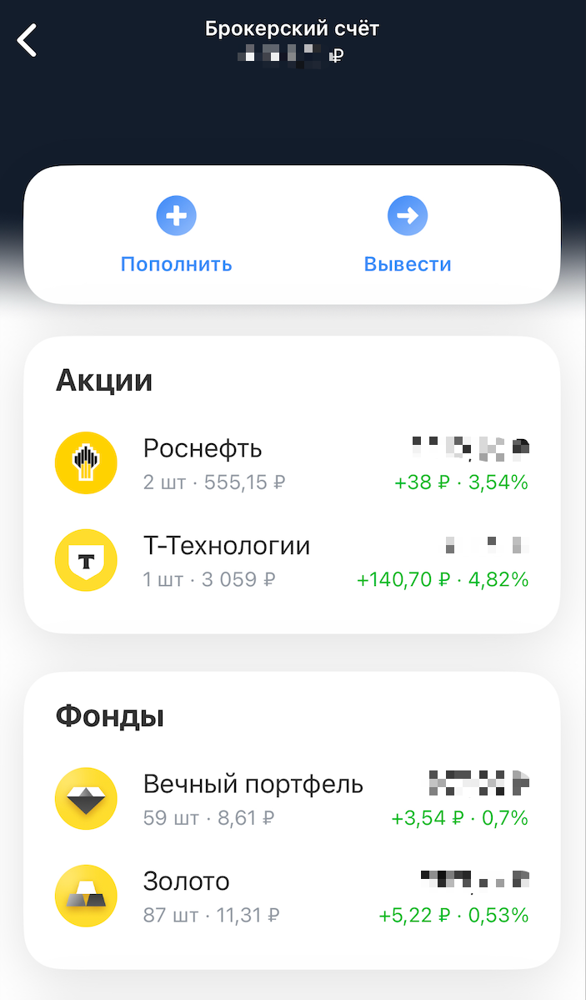

В конце прошлого года, находясь еще в Тбилиси, я регулярно начал слушать экономиста Дмитрия Потапенко. Он говорил толковые вещи, на мой взгляд, чем и вызвал у меня доверие.

Одна из его рекомендаций по долгосрочному инвестированию: покупать валюту и открывать вклады (из-за высокой процентной ставки). Инвестиции в акции, на его взгляд, совсем невыгодны, поэтому я даже не приближался к ним + наложился печальный опыт 2022-ого года, когда мои акции на 500$ были заморожены.
У меня нет большого скопленного капитала для вклада, поэтому я решил все-таки попробовать зайти снова в инвестиции, тем более сумма небольшая и потерять не так страшно.
Как итог: купил несколько акций, которые мне показались интересными, пока наблюдаю.

